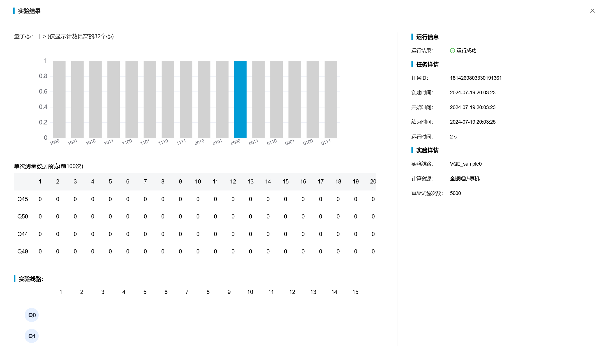
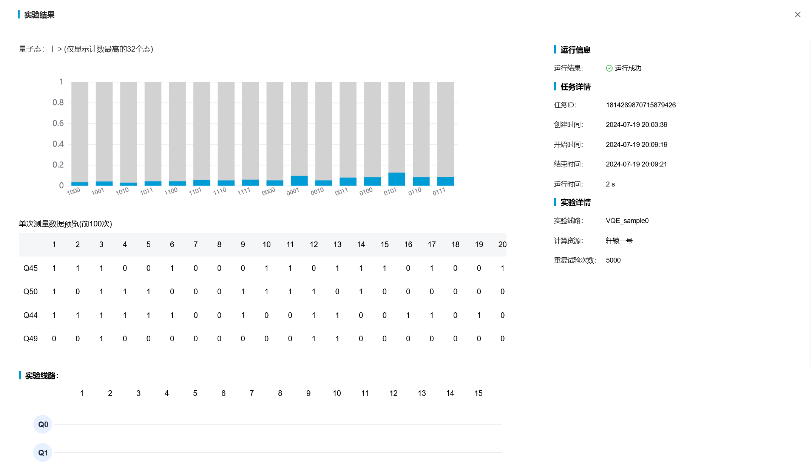

# VQE 线路化简赛道

----

获奖: 三等奖

### Solution

原理: cancel_inverses + merge_rotations + ZX-Calculus reduction  
创新: 上述方法融合 + 类遗传算法的搜索-淘汰选择机制  
第三方库依赖: pyzx

### Quick start

⚪ install

- `pip install -r requirements.txt`
- `pip install -r requirements-dev.txt` **(optional)**
  - only needed to run `verify_solut.py` and other visualization stuff 🤔

⚪ run
 
- baseline & fuse methods
  - `python opt_qcir_reduce.py -I <index>` (cancel_inverses + merge_rotations)
  - `python opt_qcir_pyzx.py -I <index>` (ZX-Calculus reduction)
  - `python opt_vqcir.py -I <index>` (⭐ The fuse final solution)
  - see [run_opt.cmd](./run_opt.cmd) for demo cmdlines
- see output at `out\example_<index>.txt`
- verify correctness: `python verify_solut.py -I <index>`
  - requires `requirements-dev.txt`

⚪ submit (`example_0.txt`)

- `python run_qcir_submit_example0.py`
  - 线路ID: 1814268150677946369
  - 任务ID
    - 模拟: 1814269803330191361
    - 真机: 1814269870715879426
  - 各比特在 Z 轴上的平均投影: `[0.1324 -0.0808  0.0864 -0.3168] (Q45 Q50 Q44 Q49)`

### Experiments

ℹ You can simply run `run_opt.cmd` to reproduce all these results below ↓↓  
ℹ The best method is surely the `fuse`, reducing `13.3061%` gate count in average :)  

| Sample Case | original | reduce | pyxz | fuse |
| :-: | :-: | :-: | :-: | :-: |
| example_0 |   64 |   56 (12.500%↓) |   56 (12.500%↓) |   56 (12.500%↓) |
| example_1 |  144 |  128 (11.111%↓) |  126 (12.500%↓) |  126 (12.500%↓) |
| example_2 |  140 |  124 (11.429%↓) |  122 (12.857%↓) |  122 (12.857%↓) |
| example_3 |  240 |  216 (10.000%↓) |  205 (14.583%↓) |  205 (14.583%↓) |
| example_4 |  266 |  242  (9.023%↓) |  232 (12.782%↓) |  232 (12.782%↓) |
| example_5 |  614 |  574  (6.515%↓) |  534 (13.029%↓) |  534 (13.029%↓) |
| example_6 |  656 |  616  (6.098%↓) |  568 (13.415%↓) |  568 (13.415%↓) |
| example_7 | 1090 | 1034  (5.138%↓) |  969 (11.101%↓) |  947 (13.119%↓) |
| example_8 | 1272 | 1216  (4.403%↓) | 1125 (11.557%↓) | 1095 (13.915%↓) |
| example_9 | 1330 | 1274  (4.211%↓) | 1171 (11.955%↓) | 1139 (14.361%↓) |

⚪ example_0.txt

| Simulator | Real Chip |
| :-: | :-: |
|  |  |

#### refenreces

- ZX-Calculus: https://zxcalculus.com/
- PyZX: https://pyzx.readthedocs.io/en/latest/gettingstarted.html
- MindQuantum 含参量子线路的等价性检查: https://hiq.huaweicloud.com/tutorial/equivalence_checking_of_PQC

----
by Armit
2024/07/02 
